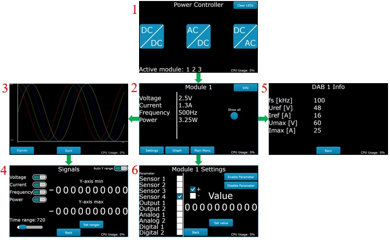

# TouchPanel_STM32F469_Embedded_Cplusplus

Part 1 of 4 of my M.Sc. Thesis project. This directory contains software of touch panel implemented on **STM32F469** board used to monitor and control parameters of power converter by communicating with power converter driver.

GUI part has been generated using **TouchGFX** framework, and it utilizes **FreeRTOS** to maintain proper GUI responsiveness.

The code of the driver implemented on **STM32 Nucleo-F411** is available in directory **2_PowerConverterDriver_STM32NucleoF411_Embedded_Cplusplus**

# Connections

# Touch panel screens

# Graph visualizations

# Flashing

Flash **STM32F469 Discovery** board using file **flash/application.hex**
