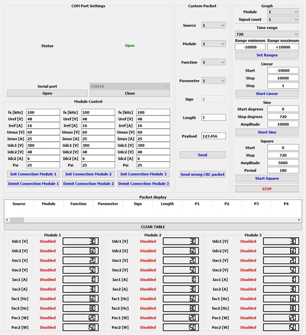
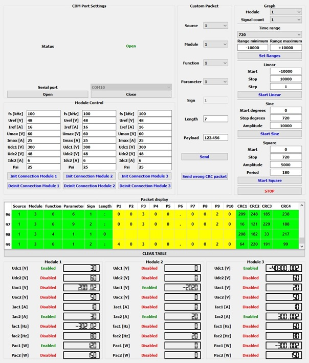

# TestApplication_PC_directly_to_NucleoF411_Qt_Cplusplus

Part 3 of 4 of my M.Sc. Thesis project. This directory contains Qt5 application used to test and visualize UART communication between PC and touch panel implemented on **STM32F469 Discovery**, as well as panel's functionalities.

**parameters.xml** files contain example initialization data for modules controlled by touch panel.

The code of the **STM32F469 Discovery** touch panel is available in directory **1_TouchPanel_STM32F469_Embedded_Cplusplus**

# How to run

Run\
**executable_windows/TestApplication_PC_directly_to_STM32F469.exe**
