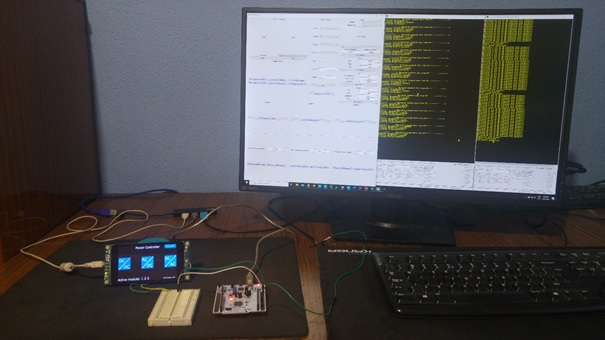

# STM32F469 Touch panel for power converter driver

This repository contains software of 4 consolidated parts of my M.Sc. thesis on the power converter controller implemented using the **STM32F469 Discovery** board. Contents of directories are briefly described below. For details please see README.md of each subproject.

## Part 1
**1_TouchPanel_STM32F469_Embedded_Cplusplus**

This directory contains software of touch panel implemented on **STM32F469** board used to monitor and control parameters of power converter by communicating with power converter driver.

## Part 2
**2_PowerConverterDriver_STM32NucleoF411_Embedded_Cplusplus**

This directory contains software of power converter driver implemented on **STM32F411-Nucleo** board used to monitor and control parameters of power converter. This application communicates directly with the touch panel implemented on **STM32F469**.

## Part 3
**3_TestApplication_PC_directly_to_STM32F469_Qt_Cplusplus**

This directory contains Qt5 application used to test UART communication between touch panel (**STM32F469 Discovery**) and power converter driver (**STM32F411-RE Nucleo**) by sending UART commands to Nucleo board which triggers communication between the two boards.

## Part 4
**4_TestApplication_PC_to_STM32F469_via_NucleoF411_Qt_Cplusplus**

This directory contains Qt5 application used to test and visualize UART communication between PC and touch panel implemented on **STM32F469 Discovery**, as well as panel's functionalities.

# How to run

Each directory contains flashable elf/hex file or Windows executable.
